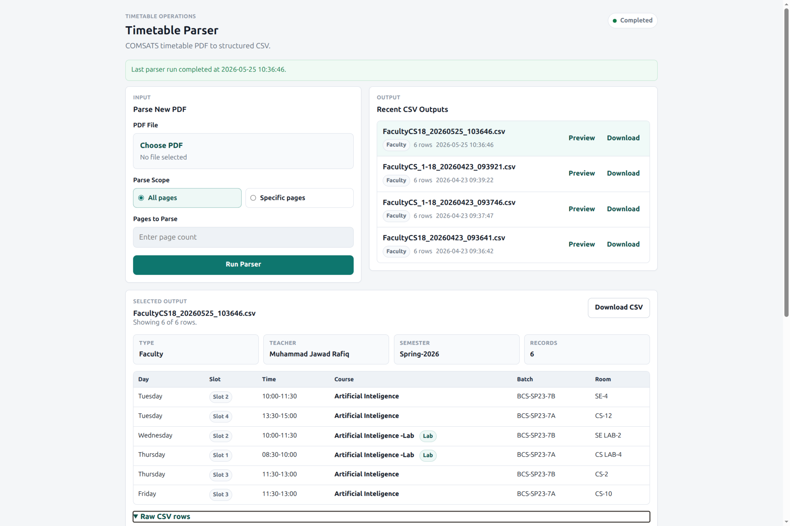
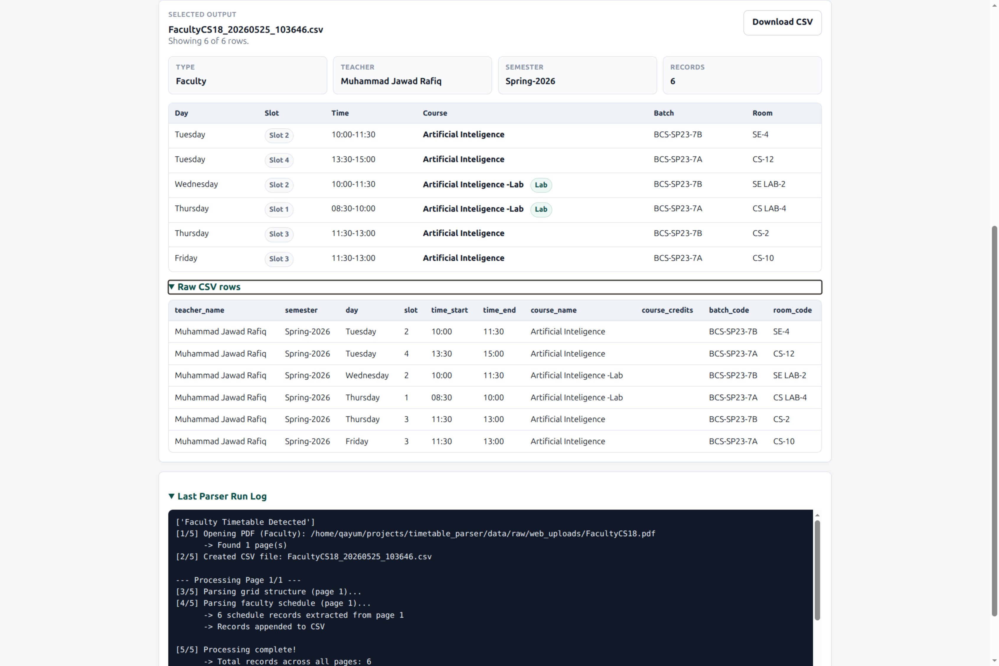

# Financial-Grade PDF Data Extraction Pipeline

A robust Python-based pipeline for extracting structured data from complex PDF layouts (University Timetables) with LLM-based normalization and automated validation.

## 🚀 Key Features

- **Advanced PDF Parsing**: Handles multi-page, grid-based PDF layouts using `pdfplumber`.
- **Hybrid Extraction Engine**:
    - **Heuristic/Regex Layer**: High-speed extraction for deterministic patterns.
    - **LLM-based Fallback (Ollama/Gemma)**: Intelligent extraction for uncertain or non-standard cells, mapping raw text to structured JSON.
- **Data Normalization**: Automated mapping of extracted fields (Faculty, Courses, Slots) to an internal classification system.
- **Structured Storage**: Exports to SQLite (relational) and timestamped CSV (interchange format).
- **Validation Dashboard**: Web UI for document intake, real-time parsing logs, and data preview.

## 🛠️ Tech Stack

- **Core**: Python 3.x, FastAPI/Flask
- **PDF Processing**: `pdfplumber`
- **LLM Integration**: Ollama (Gemma-2B/Qwen2.5) via Local API
- **Database**: SQLite (Supabase-ready schema)
- **Testing**: `pytest` for pipeline validation

## 📋 Architecture

The pipeline is designed for high accuracy in data extraction from varied vendors/formats:
1.  **Ingestion**: Document intake via CLI or Web UI.
2.  **Detection**: Grid and timetable detection to identify relevant data regions.
3.  **Extraction**: Parallel processing of cells using hybrid heuristic + LLM logic.
4.  **Normalization**: Normalizing faculty names, course codes, and room locations.
5.  **Output**: Validation-ready JSON/CSV/SQL records.

## ⚙️ Setup

```bash
pip install -r requirements.txt
# Ensure Ollama is running for LLM fallback
```

## 🖥️ Usage

### CLI Pipeline

```bash
# Process a full report
python scripts/run_parser.py data/raw/input.pdf

# Debug/Inspect PDF structure
python scripts/inspect_pdf.py data/raw/input.pdf
```

### Web Validation Dashboard

```bash
python scripts/run_web.py
```

- **URL**: `http://localhost:8000`
- **Features**: PDF upload, page-scoping, live logs, and interactive CSV preview.

## 📸 Screenshots




## 📂 Project Structure

- `src/parser/`: Core extraction logic and LLM adapters.
- `src/db/`: Database schema and seeder (SQLAlchemy/SQL).
- `src/web/`: Flask-based validation interface.
- `scripts/`: Entry points for CLI and Web services.
- `tests/`: Comprehensive test suite for extraction accuracy.
